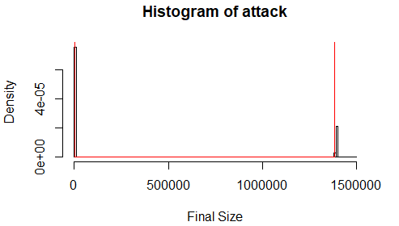
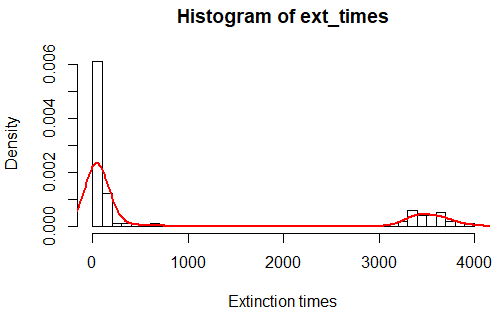

## Summary

This report was produced for a course in stochastic processes. I explored how birth-death processes, a type of continuous time Markov chain, could be applied to epidemic modelling. I found that framing epidemic outbreaks as birth-death processes allows one to estimate the probability of a major epidemic occurring, and the subsequent duration and final sizes. The projections in the report are not meant to be accurate as the models made numerous unrealistic assumptions - this was just an academic exercise in modelling.

## Introduction

COVID-19 has been declared a global pandemic by the WHO ([Cucinotta and Vanelli 2020](#ref-cucinotta_who_2020)), and a lot of attention has been focused on the
development of epidemiological models to understand its dynamics. The
Susceptible-Infectious-Removed (SIR) epidemic model is a well-known
model that captures the dynamics of an epidemic ([McKendrick 1925](#ref-mckendrick_applications_1925)). A SIR model comprises of three compartments, `\(S\)`, `\(I\)`,
and `\(R\)` that represent the number of people in a population who are
susceptible to, infected by and have recovered from a disease (and are
therefore immune). The transitions between the states are determined by
ordinary differential equations (ODEs) detailed in the equations below.

`$$\frac{dS}{dt} = - \beta I\frac{S}{N}$$`

`$$\frac{dI}{dt} = \beta I\frac{S}{N} - \gamma I$$`
$$\frac{dI}{dt} = \gamma I $$

where `\(\beta,\ \gamma\)` represent the rate of transmission and rate of
recovery of the disease. The basic reproduction number
`\(R_{0} = \beta\text{/}\gamma\)` refers to the expected number of secondary
cases directly generated by one case in a fully susceptible population,
in the absence of any intervention.

The model described above is deterministic and does not have any
inherent randomness. In other words, given certain parameters, the model
will only output one fixed trajectory of an epidemic. Deterministic
models are valid for sufficiently large populations, but are unable to
capture typically stochastic phenomena like extinction ([Rock et al. 2014](#ref-rock_dynamics_2014)). In situations where the number of infectious individuals is small
or when the variability in transmission and recovery impacts the
epidemic outcome, the randomness in stochastic models are more
appropriate ([Allen 2017](#ref-allen_primer_2017)).

The objective of this project is to explore the stochastic SIR epidemic
model in the framework of a continuous-time Markov chain – more
specifically, a birth-death process (BDP). This includes explaining the
theoretical formulation of an SIR BDP, before fitting it onto COVID-19
case data and conducting simulation-based inference from the models.

## Methods

### SIR as a Continuous-Time Markov Chain & Birth-Death Process

To formulate the SIR model as a continuous-time Markov chain (CTMC), two
discrete random variables `\(S\)` and `\(I\)` are defined to record the number
of susceptible and infectious individuals in a homogeneously mixed
closed population of size `\(N\)`, such that:

`\(S\left( t \right),I\left( t \right) \in \text{\{}0,1,\ldots,N\text{\}}\)`
where `\(t \in \left\lbrack 0,\infty \right)\)`

For a small period of time `\(\Delta t\)`, the transition probabilities for
the stochastic process are:

`$$\begin{align*} P_{\left( s,i \right),\left( s + k,i + j \right)}&\left( \Delta t \right) =\\ &P\lbrack(S(t + \Delta t),\ I(t + \Delta t) = (s + k,i + j)|(S(t),I(t) = (s,i)\rbrack \end{align*}$$`

The CTMC is a time-homogeneous process, in that the transition
probabilities do not depend on specific values of `\(t\)` but only on the
time between events, `\(\Delta t\)`. Furthermore, according to the Markov
property, the state of the process at time `\(t + \Delta t\)` depends only
on the state at time `\(t\)` and not any states prior to `\(t\)`. A birth-death
process (BDP) is a special case of the CTMC where the state variable can
only increase or decrease by 1. Under the assumption of a closed
population, the rate of births, deaths and immigration in reality is
negligible and do not affect the epidemic dynamics. Mathematically, this
means that `\(N - S\left( t \right) - I\left( t \right)\)` remains constant.
Thus, the only transition probabilities are related to infection and
recovery, as summarised below.

| Event     | Change `\(\left( \Delta S,\Delta I \right)\)` |                         Probability                         |
|:----------|:---------------------------------------------:|:-----------------------------------------------------------:|
| Infection |         `$$\left( - 1, + 1 \right)$$`         | `$$\beta i\frac{s}{N}\Delta t + o\left( \Delta t \right)$$` |
| Recovery  |          `$$\left( 0, - 1 \right)$$`          |     `$$\text{γi}\Delta t + o\left( \Delta t \right)$$`      |

The model is initialised at time `\(t = 0\)` for some infected individuals
`\(I\left( 0 \right) = i > 0\)` and `\(S\left( 0 \right) = N - i\)` susceptible
individuals, and the epidemic ends when `\(I\left( t \right) = 0\)`. In
other words, the states `\(\left( s,0 \right)\)` for all possible `\(s\)` are
absorbing states.

### Parameter estimation

#### Data

The dataset used in this paper was sourced from the Johns Hopkins
University COVID-19 repository ([CSSE 2020](#ref-jhu_csse_novel_2020)). The repository contains
data on the daily number of confirmed cases, deaths and recovered cases
for every country affected by the pandemic and is updated daily.

#### Maximum Likelihood Estimation

The likelihood for a continuously observed BDP is formulated as such:

`$$L = \prod_{k = 0}^{\infty}{\lambda_{k}}^{U_{k}}{\mu_{k}}^{D_{k}}\exp\left\lbrack - \left( \lambda_{k} + \mu_{k} \right)T_{k} \right\rbrack$$`

where `\(U_{k},D_{k}\)` are the number of up (arrivals) and down (removals)
steps respectively, and `\(T_{k}\)` is the total time spent in state `\(k\)`
over all visits to `\(k\)` ([Crawford and Suchard 2014](#ref-crawford_birth-death_2014)). `\(\lambda_{k},\mu_{k}\)` represent
the instantaneous rate at which arrivals and removals occur. For
simplification, the arrival and removal rates are assumed to be linear
`\(\lambda_{k} = k\lambda,\mu_{k} = k\mu\)`, and this process is also known
as the Kendall process. In the context of an epidemic, an arrival refers
to an infection while a removal could refer to either a recovery or
death.

However, this likelihood is difficult to evaluate analytically because
the number of COVID-19 cases is only reported at discrete time points
(daily) rather than over a continuous time. When a BDP is sampled
discretely such that only `\(X\left( 0 \right) = a\)` and
`\(X\left( t \right) = b\)` are observed, the quantities `\(U_{k}\)`, `\(D_{k}\)`,
and `\(T_{k}\)` are unknown for every state `\(k\)`, and the log-likelihood
cannot be maximised without them ([Crawford, Minin, and Suchard 2014](#ref-crawford_estimation_2014)). Previous
studies have shown that a continuous-time BDP process observed at
equidistant points form a Galton-Watson process but the transition
probabilities are complex and direct maximum likelihood estimation did
not seem feasible ([Keiding 1975](#ref-keiding_maximum_1975)).

Therefore, a data augmentation technique was applied to approximate a
continuously observed BDP. This involved splitting the daily reported
case number into individual jumps of `\(+ 1\)` or `\(- 1\)` distributed by a
uniform distribution with a width equal to `\(1\text{/}n\)`, where `\(n\)`
refers to the number of cases that occurred on that day.

An example of the result is illustrated above. On the 73rd day
since the first case in Singapore, there were 75 new cases and 16
recoveries reported. The data augmentation process split the time
interval (72,73) into 91 bins and computed 75 up steps
and 16 down steps at random. Conducting this data augmentation technique
on the daily case data enabled the maximisation of the likelihood
function to estimate the transition rates `\(\lambda,\mu\)`.
These parameters can be thought of as the transmission and recovery rate
`\(\beta,\gamma\)` in the SIR model although they are not completely the
same since `\(\mu\)` includes both deaths and recoveries. Analogously,
`\(\lambda\text{/}\mu\)` is a crude estimate of
`\(R_{0} = \beta\text{/}\gamma\)`. The maximum likelihood (ML) estimates for
`\(\lambda,\ \mu\)` and their respective standard errors are summarised below.

| Country     | `\(\lambda_{MLE}\)` |     |                SE                 |     | `\(\mu_{MLE}\)` |     |                SE                 | `\(\lambda/\mu\)` |
|:------------|:-------------------:|-----|:---------------------------------:|-----|:---------------:|-----|:---------------------------------:|:-----------------:|
| France      |        0.100        |     | 2.06 `\(\times\)` 10-7 |     |     0.0371      |     | 1.25 `\(\times\)` 10-7 |       2.71        |
| Singapore   |        0.138        |     | 7.78 `\(\times\)` 10-6 |     |     0.0163      |     | 2.67 `\(\times\)` 10-6 |       8.46        |
| South Korea |       0.0409        |     | 7.77 `\(\times\)` 10-7 |     |     0.0319      |     | 6.86 `\(\times\)` 10-7 |       1.28        |
| Sweden      |       0.0729        |     | 1.37 `\(\times\)` 10-6 |     |     0.0106      |     | 5.21 `\(\times\)` 10-7 |       6.88        |
| Thailand    |       0.0766        |     | 7.67 `\(\times\)` 10-6 |     |     0.0547      |     | 6.48 `\(\times\)` 10-6 |        1.4        |

A limitation of the linear BDP is that it assumed that rates
`\(\lambda,\mu\)` are constant throughout the outbreak. This is not likely
to be true in reality as the rates are very sensitive to day-to-day
changes in the number of reported cases. For example, while Singapore
has been relatively successful in managing the epidemic initially, the
recent spike in cases reported in Singapore around 20th April
([Griffith 2020](#ref-griffith_singapore_2020)) have resulted in a sharp increase in `\(\lambda\)`. Thus,
the estimates tend to vary greatly depending on the state of the
epidemic at the time.

As such, a more accurate interpretation of `\(\lambda,\ \mu\)` is a
reflection how successful the countries have been in controlling the
epidemic. Low values of `\(\lambda\)` indicate a success in reducing the
rate at which infections occur. The countries highlighted above were
selected to highlight a range of scenarios for different points of the
outbreak. South Korea has been shown to have largely controlled the
epidemic ([Normile 2020](#ref-normile_coronavirus_2020)), while the other countries are still dealing
with a large number of cases. The relative low rates of `\(\lambda,\ \mu\)`
for South Korea support this statement. However, it should be noted that
the removal rate `\(\mu\)` includes both recoveries and deaths, so while
Singapore and Sweden appear to have very high `\(\lambda\text{/}\mu\)`
(which is analogous to `\(R_{0}\)`), their situation may not be as bad as in
France, which has a relatively high `\(\mu\)` that includes a large number
of deaths ([Ward 2020](#ref-ward_why_2020)).

Despite their simplification, the MLE estimates for `\(\lambda,\mu\)` may
still serve to highlight how different epidemics are expected to
progress through simulation.

## Simulation-based Results

The estimated model parameters were used to simulate various
trajectories of the epidemic in the respective countries. The Gillespie
algorithm allows for the simulation of possible solutions of a
stochastic equation ([Gillespie 1977](#ref-gillespie_exact_1977)) and can be applied in this
scenario. The pseudocode of the algorithm is provided below.

<table style="width:99%;">
<colgroup>
<col style="width: 98%" />
</colgroup>
<tbody>
<tr class="odd">
<td><ol type="i">
<li>
Generate <code>\(U_{1} \sim \text{Unif}\left\lbrack 0,1 \right\rbrack\)</code>
and <code>\(U_{2} \sim \text{Unif}\left\lbrack 0,1 \right\rbrack\)</code>
</li>
<li>
Calculate rate, <code>\(\lambda = \beta*S*I\text{/}N + \gamma*I\)</code>
</li>
<li>
Compute time to next event,
<code>\(\tau = - \ln\left( U_{1} \right)\text{/}\lambda\)</code>
</li>
<li>
Compute probability of up step,
<code>\(p = \left( \beta*s*i\text{/}N \right)\text{/}\lambda\)</code>
</li>
<li>
Compute direction of next event,
<code>\(I_{\text{new}} = \text{binomial}\left( 1,p \right)*2 - 1\)</code>
</li>
<li>
Update time <code>\(t = t + \tau\)</code> and state <code>\(I = I + I_{\text{new}}\)</code>
</li>
<li>
If process is extinct, i.e. <code>\(x = 0\)</code>, the simulation ends. Else,
return to step i.
</li>
</ol></td>
</tr>
</tbody>
</table>

The stochastic nature of each epidemic allows some inference to be made
about the paths of the epidemic. These include the i. probability of a
major outbreak, ii. the final size and iii. duration of the epidemic.
For each country, a total of 100 simulations were run until
`\(I\left( t \right) = 0\)` and the extinction times
`\(inf\text{\{}t > 0|I(t) = 0\text{\}}\)` and final sizes of the epidemic
were recorded. The simulated results were then compared with their
deterministic ODE counterparts.

### Probability of Major Outbreak

Due to the stochasticity of the birth-death process, there is a
possibility of infections being removed before a major epidemic
occurred, so not all processes will lead to major outbreaks. Here, a
major epidemic is characterised as one that has a generally longer
duration and substantially greater number of cases than a minor epidemic
([Tritch and Allen 2018](#ref-tritch_duration_2018)). Theoretically, only minor epidemics occur when
`\(R_{0} < 1\)` and given `\(R_{0} > 1\)`, the probabilities of a minor and
major epidemic are `\(\left( 1\text{/}R_{0} \right)^{i}\)` and
`\(1 - \left( 1\text{/}R_{0} \right)^{i}\)` respectively, where `\(i\)` refers
to the initial number of infected individuals ([Whittle 1955](#ref-whittle_outcome_1955)). The
distinction between the two types of epidemics is illustrated nelow at different scales.

The probability of a major epidemic occurring can be approximated by the
proportion of simulated Markov chains that resulted in a major epidemic.
The results are summarised below.

| Country     | Theoretical `\(P(\text{major})\)` | Estimated `\(P(\text{major})\)` |
|:------------|:---------------------------------:|:-------------------------------:|
| France      |               0.631               |              0.84               |
| Singapore   |               0.881               |              0.85               |
| South Korea |               0.219               |              0.24               |
| Sweden      |               0.855               |              0.86               |
| Thailand    |               0.286               |               0.5               |

The estimated probability of a major outbreak is largely correlated to
the theoretical value `\(\left( R^{2} = 0.81 \right)\)`, although the
strength of association varies. The variance could be attributed two
sources: firstly, `\(\lambda\text{/}\mu\)` is only a crude estimator of
`\(R_{0} = \beta\text{/}\gamma\)` and secondly, the stochastic nature of the
simulations results in a variable probability of major outbreak. Only
the second source can be addressed by increasing the number of
simulations, which also increases the time and computational cost.

The results are consistent with the understanding that South Korea has
been successful in managing the outbreak and effectively reduced the
probability of a major outbreak occurring. On the other hand, the
probability of major outbreaks occurring in the other countries are
substantially higher.

## Final Size

The final size of the outbreak refers to the total number of people
expected to be infected by the disease. Bayes’ rule can be leveraged to
estimate the final size based on the outcome of the simulated epidemics.

`$$E\left\lbrack \text{final size} \right\rbrack = E\left\lbrack \text{final size} \middle| \text{major} \right\rbrack P\left( \text{major} \right) + E\left\lbrack \text{final size} \middle| \text{minor} \right\rbrack P\left( \text{minor} \right)$$`

The typical distribution of final sizes is illustrated above. The
distribution is characteristically bimodal with the final size depending
on whether a minor or major epidemic occurred. The simulation results
are summarised below and compared with the final size of the
deterministic models.

| Country     | `\(E[\cdot\| ext{major}]\)` | `\(E[\cdot\| ext{minor}]\)` |  `\(E[ext{final size}]\)`   |   %   |             ODE             |  %   |
|-------------|:---------------------------:|:---------------------------:|:---------------------------:|:-----:|:---------------------------:|:----:|
| France      | 1.73$\times$ 107 |            3.25             |  1.44$imes$ 107  | 21.9  | 1.71$\times$ 107 |  26  |
| Singapore   | 3.68$\times$ 106 |              1              | 3.12$\times$ 106 | 53.4  | 3.67$\times$ 106 | 62.8 |
| South Korea | 1.39$\times$ 106 |            2.54             | 3.35$\times$ 105 | 0.652 | 1.36$\times$ 106 | 2.65 |
| Sweden      | 5.79$\times$ 106 |            1.36             | 4.98$\times$ 106 | 49.4  | 5.79$\times$ 106 | 57.4 |
| Thailand    | 3.17$\times$ 106 |            3.22             | 1.58$\times$ 106 | 2.23  | 3.17$\times$ 106 | 4.53 |

From the table above, the expected final sizes given that a major outbreak
occurred `\(E[\cdot|\text{major}]\)` are very
similar to the deterministic ODE solution. Given that a minor outbreak
occurred, the expected final size is extremely small. A possible
interpretation of this is that the threshold for a major epidemic
occurring is very low, seeing that an outbreak only needs to exceed on
average 2-3 infections before it progresses into a large epidemic. This
is more likely in a homogenous population where people interact with
everyone else on a regular basis but that may not be a realistic
setting.

It is also interesting to note the differences in the estimated final
size `\(E[\text{final size}]\)` and the ODE
solution. The estimated final sizes are much lower than the ODE
solutions because they account for the possibility of no major epidemics
occurring. In a way these can be interpreted as more realistic final
sizes than the deterministic solution.

## Expected Duration

The simulated results also allow one to estimate the duration of the
outbreak, or in other words, the extinction time. Most theoretical
research has focused on the duration of epidemics conditioned on
non-extinction (Tritch & Allen, 2018). However, since the outbreaks were
simulated till extinction, this project will only estimate the duration
conditioned on extinction. Similar to the final size estimation, a
possible simulation-based estimate of duration can be formulated by
Bayes rule as such:

`$$E\left\lbrack \text{duration} \right\rbrack = E\left\lbrack \text{d}\text{uration} \middle| \text{major} \right\rbrack P\left( \text{major} \right)\  + \ E\left\lbrack \text{duration} \middle| \text{minor} \right\rbrack P\left( \text{minor} \right)$$`

The plot above illustrates the distribution of extinction times. It follows a
clear bimodal distribution given the respective outcomes (minor or major
outbreaks). The results are summarised below. Since
deterministic epidemic models only approach 0 but never become fully
extinct, the extinction time for the ODE solution is taken to be when
`\(I\left( t \right) < 1\text{/}N\)`, or when there is less than 1 infected
person in the population.

| Country     | `\(E[\cdot\|\text{major}]\)` | `\(E[\cdot\|\text{minor}]\)` | `\(E[\text{duration}]\)` | ODE  |
|:------------|:----------------------------:|:----------------------------:|:------------------------:|:----:|
| France      |             909              |             23.4             |           767            | 894  |
| Singapore   |             1130             |             7.00             |           965            | 1070 |
| South Korea |             3530             |             60.1             |           893            | 3710 |
| Sweden      |             1870             |             20.8             |           1614           | 1780 |
| Thailand    |             1640             |             33.5             |           835            | 1630 |

Similar to the expected final size, the expected duration given a major
epidemic is close to the ODE solution. The overall expected duration can
also be interpreted as a more realistic figure than the ODE solution
since it accounts for the probability of only a minor outbreak
occurring.

## Discussion

The results summarised below illustrate that the selected countries have
varied success in managing the COVID-19 pandemic. As mentioned earlier
in this report, South Korea seemed to have the epidemic under control.
Although the outbreak in South Korea is expected to last for almost as
long as any other country, the low rates of `\(\lambda,\ \mu\)` resulted in
the lowest probability of a major outbreak occurring and a substantially
smaller estimated final size. However, the model is only able to capture
one single epidemic and is unable to forecast future outbreaks which may
drastically affect the final size and duration.

| Country     | Estimated `\(P(\text{major})\)` | `\(E[\text{final size}]/N\)` (%) | `\(E[\text{duration}]\)` |
|:------------|:-------------------------------:|:--------------------------------:|:------------------------:|
| France      |              0.84               |               21.9               |          767.44          |
| Singapore   |              0.85               |               53.4               |          965.03          |
| South Korea |              0.24               |              0.652               |          892.59          |
| Sweden      |              0.86               |               49.4               |         1613.81          |
| Thailand    |              0.50               |               2.23               |          835.4           |

Although the results may seem worrying for Singapore and Sweden, which
have an expected 53.4% and 49.4% of their population infected by COVD-19
respectively, it is important to note that these simulations were unable
to account for direct public health intervention to reduce disease
transmission. In Singapore, where strict physical distancing measures
have been introduced, the final size will likely be much lower than
expected. Nonetheless, these figures serve to highlight a possible
‘worst case’ scenario where COVID-19 is allowed to transmit freely in a
highly mixed, homogeneous population.

## Limitations

The BDP model used in this project was mainly limited by its
assumptions. Firstly, the model assumed a closed population for each
country, and did not consider the effects of births, deaths, or
immigration on the epidemic dynamics. This was not a realistic
assumption to make since the epidemics have been estimated to last for
more than 3 years, during which other demographic effects
might have affected the rates of infection and recovery, as well as the
population size. From initial reports during the pandemic, it was also
understood that immigration was a significant factor in transmission
([Pinotti et al. 2020](#ref-pinotti_lessons_2020)) and should be included in further analysis.

Secondly, for ease of estimating the likelihood, the removal process was
simplified to include both recovery and death. This ‘R’ state in SIR is
ambiguous and does not capture the severity of the outbreak beyond the
number of infected cases. In other words, a country may have a high
removal rate leading to a smaller epidemic, but this may or may not be a
satisfactory outcome depending on the number of recovered cases relative
to deaths. Future work may be undertaken to differentiate between
recovered cases and deaths in order to have a clearer representation of
the severity of the epidemic.

Furthermore, the Markov property, while useful in simplifying complex
phenomena, does not always hold in reality as it does not consider
historical trends beyond the past day, when in reality a lot of
processes that underpin disease transmission are dependent on time
periods much longer than one day. Thus, the BDP model is only useful for
early approximations.

It should also be noted that a model is only as good as the data it is
fed. The data used in the model only contains reported cases and the
proportion of cases reported varies largely depending on different
countries’ disease surveillance systems. This may not be representative
of the true state of COVID-19 in various countries especially if they
lack adequate testing. Nonetheless, the reported number of cases is the
most direct way that the state of the epidemic can be observed, even if
the statistics may be flawed.

Lastly, since the BDP approximation considers only +1 and -1 transitions
between states, it is a time-consuming process to estimate parameters
and conduct simulations for countries reported to have a large number of
infections. For this reason, countries that were adversely affected by
COVID-19 with over 100,000 confirmed cases, including the US, China and
Italy, were excluded from this study even though it would have been of
value to include them.

## Conclusion

In conclusion, this project highlighted an application of birth-death
processes to the COVID-19 pandemic. Firstly, it introduced the
theoretical formulation of an SIR BDP and its transition probabilities.
Secondly, a data augmentation technique was used to overcome the
difficulty of computing maximum likelihood estimation on discretely
observed BDP. The parameter estimates were then used to simulate
outbreaks in different countries, and simulation-based inference was
conducted. Lastly, the limitations of applying the BDPs to study the
COVID-19 pandemic was discussed at length.

Overall, this project has shown that while the birth-death process is
useful in modelling the number of COVID-19 infections, it is largely
limited by its assumptions. The model could be refined by introducing
more flexibility in order to represent other more complex aspects of the
outbreak such as recovery, deaths, demographic trends, and public health
interventions.

## References

Allen, Linda J. S. 2017. “A Primer on Stochastic Epidemic Models: Formulation, Numerical Simulation, and Analysis.” *Infect Dis Model* 2 (2): 128–42. <https://doi.org/10.1016/j.idm.2017.03.001>.

Crawford, Forrest W., Vladimir N. Minin, and Marc A. Suchard. 2014. “Estimation for General Birth-Death Processes.” *J Am Stat Assoc* 109 (506): 730–47. <https://doi.org/10.1080/01621459.2013.866565>.

Crawford, Forrest W., and Marc A. Suchard. 2014. “Birth-Death Processes.” *arXiv:1301.1305 \[q-Bio, Stat\]*, July. <http://arxiv.org/abs/1301.1305>.

CSSE, JHU. 2020. “Novel Coronavirus (COVID-19) Cases.” Johns Hopkins University. <https://github.com/CSSEGISandData/COVID-19>.

Cucinotta, Domenico, and Maurizio Vanelli. 2020. “WHO Declares COVID-19 a Pandemic.” *Acta Biomed* 91 (1): 157–60. <https://doi.org/10.23750/abm.v91i1.9397>.

Gillespie, Daniel T. 1977. “Exact Stochastic Simulation of Coupled Chemical Reactions.” *J. Phys. Chem.* 81 (25): 2340–61. <https://doi.org/10.1021/j100540a008>.

Griffith, James. 2020. “Singapore Had a Model Coronavirus Response, Then Cases Spiked. What Happened?” *CNN*, April. <https://www.cnn.com/2020/04/18/asia/singapore-coronavirus-response-intl-hnk/index.html>.

Keiding, Niels. 1975. “Maximum Likelihood Estimation in the Birth-and-Death Process.” *Ann. Statist.* 3 (2): 363–72. <https://doi.org/10.1214/aos/1176343062>.

McKendrick, A. G. 1925. “Applications of Mathematics to Medical Problems.” *Proceedings of the Edinburgh Mathematical Society* 44 (February): 98–130. <https://doi.org/10.1017/S0013091500034428>.

Normile, Dennis. 2020. “Coronavirus Cases Have Dropped Sharply in South Korea. What’s the Secret to Its Success?” *Science AAAS*. <https://www.sciencemag.org/news/2020/03/coronavirus-cases-have-dropped-sharply-south-korea-whats-secret-its-success>.

Pinotti, Francesco, Laura Di Domenico, Ernesto Ortega, Marco Mancastroppa, Giulia Pullano, Eugenio Valdano, Pierre-Yves Boelle, Chiara Poletto, and Vittoria Colizza. 2020. “Lessons Learnt from 288 COVID-19 International Cases: Importations over Time, Effect of Interventions, Underdetection of Imported Cases.” *medRxiv*, February, 2020.02.24.20027326. <https://doi.org/10.1101/2020.02.24.20027326>.

Rock, Kat, Sam Brand, Jo Moir, and Matt J. Keeling. 2014. “Dynamics of Infectious Diseases.” *Rep. Prog. Phys.* 77 (2): 026602. <https://doi.org/10.1088/0034-4885/77/2/026602>.

Tritch, William, and Linda J. S. Allen. 2018. “Duration of a Minor Epidemic.” *Infectious Disease Modelling* 3 (January): 60–73. <https://doi.org/10.1016/j.idm.2018.03.002>.

Ward, Alex. 2020. “Why France Has 4 Times as Many Coronavirus Deaths as Germany.” *Vox*. <https://www.vox.com/2020/4/17/21223915/coronavirus-germany-france-cases-death-rate>.

Whittle, P. 1955. “The Outcome of a Stochastic Epidemic–A Note on Bailey’s Paper.” *Biometrika* 42 (1/2): 116–22. <https://doi.org/10.2307/2333427>.

